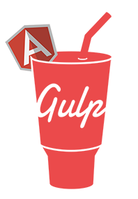

<p align="center"></p>

[![Build status][travis-image]][travis-url] [![Dependency status][dependency-image]][dependency-url]

# Gulp based boilerplate for AngularJS Apps

## Features

* [Bower](http://bower.io/) -- for js plugins. Just install plugin and set main file in `bower.json` at `overrrides` section. Also you can ignore files. And Gulp will concat all in one file `plugins.min.js`. For example:

```js
"overrides": {
	"bootstrap-sass-official": {
		"ignore": "*"
	},
	"select2": {
		"main": "select2.js"
	}
}
```
* [LESS](http://lesscss.org/) -- for css
* [BrowserSync](http://www.browsersync.io/docs/gulp/) -- it's really cool feature. It syncs page on every opened devices. Clicks, scrolls, forms are synced also. [Read more](http://www.smashingmagazine.com/2014/06/11/building-with-gulp/)

## How to run?

* download this repo
* `npm install && bower install`
* for develop run `gulp`
* open in browser `http://localhost:3000/`

## Afterword

This boilerplate is under constraction because turn from Grunt to Gulp. But it can be used for own projects with some modernizations. Later I will add more features, such as images optimization, sprites, etc.


[travis-image]: https://travis-ci.org/htmlacademy-javascript/150948-kekstagram.svg?branch=master
[travis-url]: https://travis-ci.org/htmlacademy-javascript/150948-kekstagram
[dependency-image]: https://david-dm.org/htmlacademy-javascript/150948-kekstagram.svg?style=flat-square
[dependency-url]: https://david-dm.org/htmlacademy-javascript/150948-kekstagram
